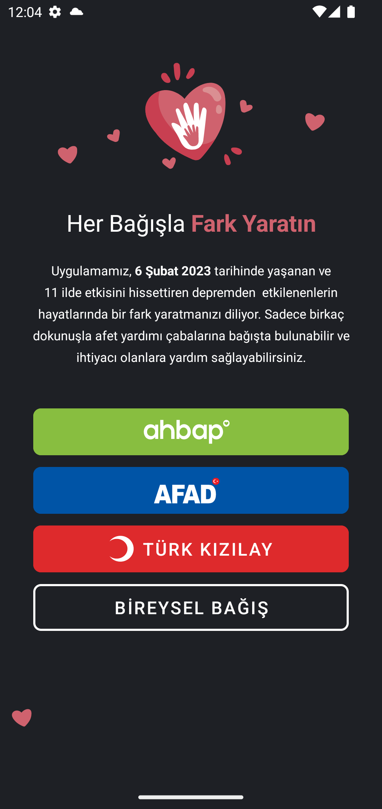
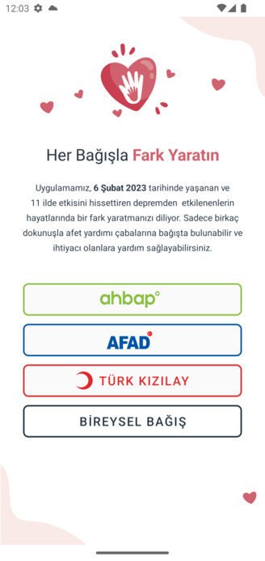

# AndroQuake-SDK
AndroQuake-SDK to show donation page easily in your app.

## Examples
<p align="center">
  
  
</p>

## Requirements
* Android Api 21+
* MaterialComponents Theme

# Download

### Step 1. Add the JitPack repository to your build file

```
allprojects {
    repositories {
	    ...
	    maven { url 'https://jitpack.io' }
	}
}

```

### Step 2. Add the dependency

```
dependencies {
    implementation 'com.github.mobven:AndroQuake-SDK:1.0.1'
}
```

## Usage
### Default Donation
AndroQuake can be initialized through, which has default title and message those are presented in the screenshot above.
```kotlin
// call this constructor wherever you want providing context
Donation.Builder(this).build()
```

### Custom title, message and logo
If you want to use custom logo, title and description, you can use below builder.
```kotlin 
Donation.Builder(this)
  .logo(R.drawable.my_custom_logo)
  .title("Donate")
  .description("Donation lorem impsum...")
  .build()
```


### Spanned title and message, and custom logo
If you want to show fancy title and description, you can use our *DonationText* wrapper to make a spannable string.
```kotlin    
Donation.Builder(this)
  .logo(R.drawable.my_custom_logo)
  .titleSpan(DonationText(SpannableString.valueOf("Donate")))
  .descriptionSpan(DonationText(SpannableString.valueOf("Donation lorem impsum...")))
  .build()
```

### Custom Action Buttons
By default it has, AHBAP, AFAD and Turk Kizilayi buttons. If you want to add custom buttons, you can use our *DonateButton* to make a your button.
```kotlin
Donation.Builder(this)
  .logo(R.drawable.my_custom_logo)
  .titleSpan(DonationText(SpannableString.valueOf("Donate")))
  .descriptionSpan(DonationText(SpannableString.valueOf("Donation lorem impsum...")))
  .donationButtons(
    mutableListOf(
      DonateButton(
        icon = R.drawable.logo,
        link = "https://ahbap.org/bagisci-ol",
        strokeColor = R.color.color_green_ahbap,
        backgroundColor = R.color.color_bg_ahbap
    ),
    DonateButton(
        icon = R.drawable.logo,
        link = "https://www.afad.gov.tr/depremkampanyasi2",
        strokeColor = R.color.color_green_afad,
        backgroundColor = R.color.color_bg_afad
    ),
    DonateButton(
       label = "BİREYSEL BAĞIŞ",
       link = "#bagisyap"
    )
 )
).build()
```
